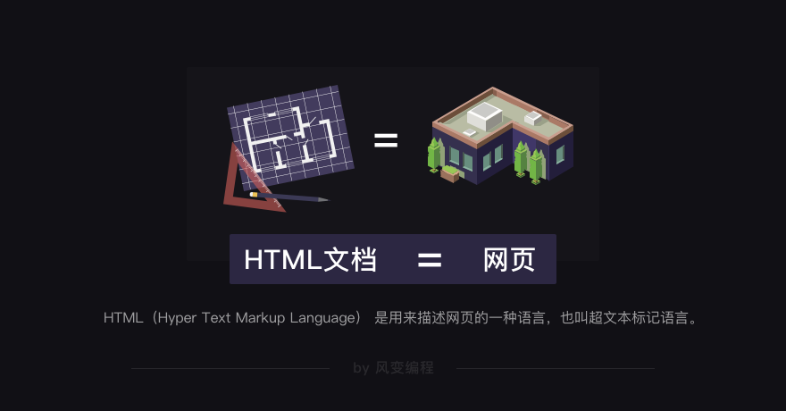
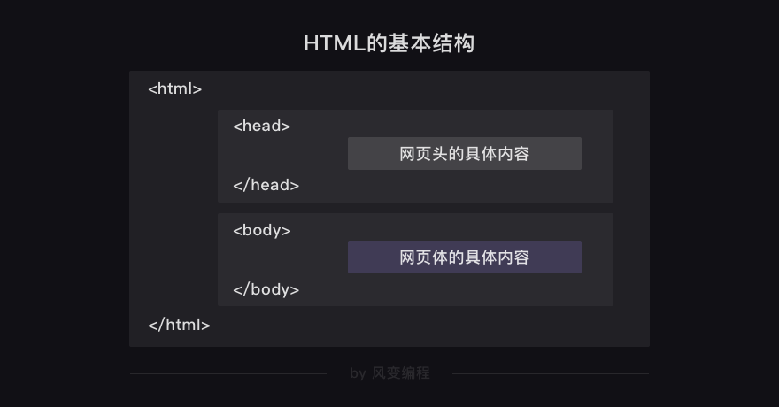
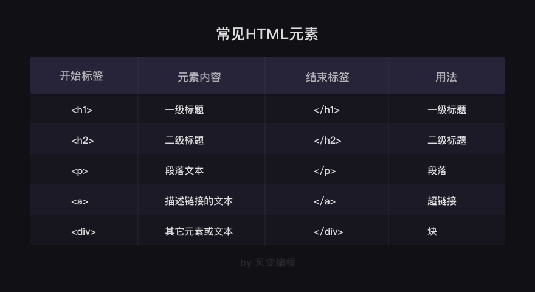
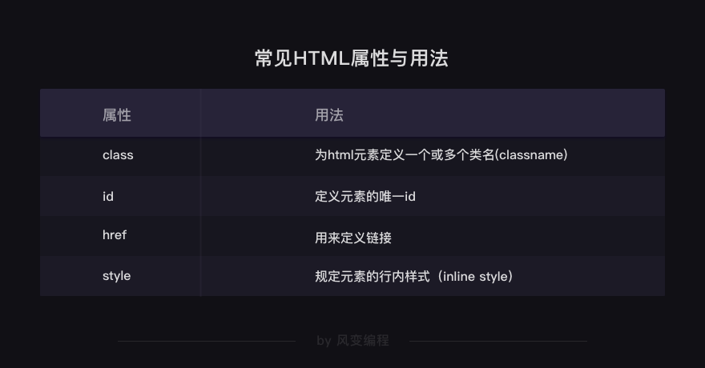
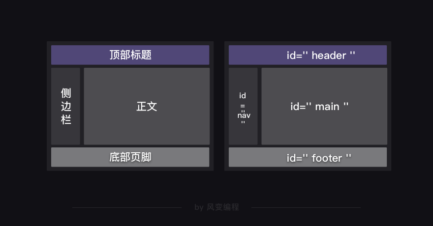

# HTML基础
学习HTML的层次：

- 读懂
- 修改
- 编写，前端工程师水平

# 什么是HTML？

HTML是一种用来描述网页的语言，HTML对网页的描述就相当于建筑图纸对建筑实体的描述。



向浏览器中输入某个网址后，浏览器会向服务器发出请求，然后服务器就会作出响应。其实，服务器返回给浏览器的这个结果就是HTML代码了。

# HTML基本结构

## 查看网页源代码的方法：

- 右键-点击“显示网页源代码“, ctrl+u;
- （空白地方）右键-点击“检查“, ctrl+shift+i;

## 层级

万事万物都是有条理的。

HTML文档的基本是由【网页头】和【网页体】组成的。

HTML文档的最外层标签一定是<html>，里面嵌套着<head>元素与<body>元素。<head>元素代表了【网页头】，<body>元素代表了【网页体】，这是最基本的网页结构。

HTML文档和网页的内容一定是一一对应的。只是，【网页头】的内容不会被直接呈现在浏览器里的网页正文中，而【网页体】的内容是会直接显示在网页正文中的。来具体看看：



# 标签和元素



```html
<html>
	<head>
		<meta charset="utf-8"> 
	</head>
    <body>
        <h1>我是一级标题</h1>
        <h2>我是二级标题</h2>
        <h3>我是三级标题</h3>
        <p>我是一个段落啦。一级标题、二级标题和我，我们三个一起组成了body。</p>
    </body>
</html>
```

夹在尖括号<>中间的字母，它们叫做【标签】。

标签通常是成对出现的：前面的是【开始标签】，比如<body>；后面的是【结束标签】，如</body>。

也有标签是形单影只地出现，比如<meta charset="utf-8">（定义网页编码格式为 utf-8）

**开始标签+结束标签+中间的所有内容**，它们在一起就组成了【元素】

HTML标签是可以嵌套标签的，而且可以多层嵌套；这就像是在电脑中，一个硬盘可以包含数个文件夹，文件夹中还可以嵌套文件夹。

# 属性


## style

style属性可以用来定义网页文本的样式，比如字体大小、颜色、间距、对齐方式等等。

```html
<!--给<h1>元素添加了一个style属性，属性中的内容规定了这行文字的颜色。-->
<h1 style="color:#20b2aa;">这个书苑不太冷</h1>
```

style属性添加在了< h1 >的开始标签中，因为属性通常都是在HTML元素的开始标签中设置的。

## href

链接一般都由< a >标签定义，href属性用于规定指向页面的URL.

```html
<a href="https://wordpress-edu-3autumn.localprod.oc.forchange.cn/">我是一个链接，点我试试</a>
```

## class

```html
<html>
    <head>
        <meta charset="utf-8"> 
        <title>这个书苑不太冷3.0</title>
        <style> 
            .book {
                /*以下是.book的具体样式规定*/
                float: left;               /*控制元素浮动*/
                margin: 5px;               /*外边距为5像素*/
                padding: 15px;             /*内边距为15像素*/
                width: 350px;              /*宽度为350像素*/
                height: 240px;             /*高度为240像素*/
                border: 3px solid #20b2aa; /*边框为3像素*/
            } 
        </style>
    </head>
  
    <body>
        <h1 style="color:#20b2aa;">这个书苑不太冷</h1>
        <h3>吴枫喜欢的书:</h3>
        <a href="https://wordpress-edu-3autumn.localprod.oc.forchange.cn/">点这里看看</a>
        <div class="book">
            <h2>《奇点遗民》</h2>
            <p>本书精选收录了刘宇昆的科幻佳作共22篇。《奇点遗民》融入了科幻艺术吸引人的几大元素：数字化生命、影像化记忆、人工智能、外星访客……刘宇昆的独特之处在于，他写的不是科幻探险或英雄奇幻，而是数据时代里每个人的生活和情感变化。透过这本书，我们看到的不仅是未来还有当下。
            </p>
        </div>
    </body>
</html>
```

< style >元素的内容，是对.book的具体描述，比如float: left;，而/*控制元素浮动*/是对代码的注释。

.对应class，所以.book代表class book。因此，网页头中的.book和网页体中的class="book"是有联系的。

在网页头里面，定义了class属性，属性值为"book"，然后下面一长串代码是对这个class属性的描述；接着再在网页体中调用，所以看到了< div class="book" >。

在HTML中，class属性也可以被多次利用。

## id

id属性和class属性的用法类似，给元素定义id和class的目的都是为了查找、定位元素，或者为元素设置样式。

id属性用于标识唯一的元素，而class用于标识一系列的元素。id就像是学生的学生证号码，每个人都是唯一的；而学生们可以属于同一个班级，班级就像class。



# 读代码

代码示例：

```html
<div id="article">
    <div id="nav">
        <a href="#type1" class="catlog">科幻小说</a><br>
        <a href="#type2" class="catlog">人文读物</a><br>
        <a href="#type3" class="catlog">技术参考</a><br>
    </div>
    <div id="main">
        <div class="books">
            <h2><a name="type1">科幻小说</a></h2>
            <a href="https://book.douban.com/subject/27077140/" class="title">《奇点遗民》</a>
            <p class="info">本书精选收录了刘宇昆的科幻佳作共22篇。《奇点遗民》融入了科幻艺术吸引人的几大元素：数字化生命、影像化记忆、人工智能、外星访客……刘宇昆的独特之处在于，他写的不是科幻探险或英雄奇幻，而是数据时代里每个人的生活和情感变化。透过这本书，我们看到的不仅是未来还有当下。</p> 
            
            <br/>
            <br/>
            <hr size="1">
        </div>
        
        <div class="books">
            <h2><a name="type2">人文读物</a></h2>
            <a href="https://book.douban.com/subject/26943161/" class="title">《未来简史》</a>
            <p class="info">未来，人类将面临着三大问题：生物本身就是算法，生命是不断处理数据的过程；意识与智能的分离；拥有大数据积累的外部环境将比我们自己更了解自己。如何看待这三大问题，以及如何采取应对措施，将直接影响着人类未来的发展。</p> 
            
            <br/>
            <br/>
            <hr size="1">
        </div>
        
        <div class="books">
            <h2><a name="type3">技术参考</a></h2>
            <a href="https://book.douban.com/subject/25779298/" class="title">《利用Python进行数据分析》</a>
            <p class="info">本书含有大量的实践案例，你将学会如何利用各种Python库（包括NumPy、pandas、matplotlib以及IPython等）高效地解决各式各样的数据分析问题。由于作者Wes McKinney是pandas库的主要作者，所以本书也可以作为利用Python实现数据密集型应用的科学计算实践指南。本书适合刚刚接触Python的分析人员以及刚刚接触科学计算的Python程序员。</p> 
            
            <br/>
            <br/>
            <hr size="1">
        </div>
    </div>
</div>
```

# 修改网页

在网页源代码中，找到元素，双击修改内容。

# 获取网页数据

```python
import requests

url = "https://localprod.pandateacher.com/python-manuscript/crawler-html/spider-men5.0.html"
res = requests.get(url)

f = open('target.txt', 'a')
f.write(res.text)
f.close()
```

浏览器的工作原理：浏览器从服务器上接收一个HTML文档，然后拿去做解析，最后呈现给你。因此，它也可以把你电脑的HTML文档解析成漂亮的网页。